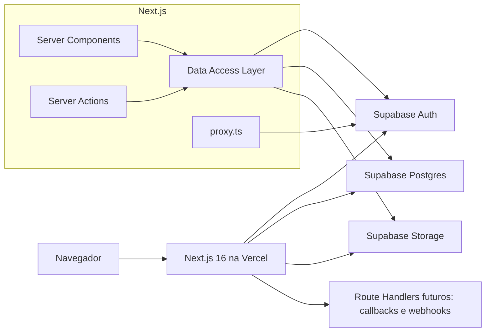

# Plano de migracao: Casa Verde para Next.js + Supabase

## 1. Objetivo

Migrar o prototipo em `ref/casa-verde` para a aplicacao Next.js existente na raiz
do repositorio, substituindo:

- o SPA Vite e o React Router pelo Next.js App Router;
- o backend Express hospedado no Render por codigo server-side do Next.js;
- o PostgreSQL do Neon pelo PostgreSQL do Supabase;
- o JWT, bcrypt e armazenamento de sessao manuais pelo Supabase Auth;
- o `localStorage` usado como banco pelo Supabase;
- os tres pontos de operacao atuais (Vercel, Render e Neon) por Vercel e
  Supabase.

O resultado deve preservar a experiencia visual e as funcionalidades relevantes
do prototipo, mas nao deve reproduzir suas fragilidades de seguranca nem manter
duas implementacoes concorrentes de persistencia.

## 2. Resumo executivo

### Recomendacao

Fazer uma reimplementacao incremental dentro do projeto Next.js atual, usando o
codigo em `ref/casa-verde` como referencia visual e funcional. Nao portar o
Express para Route Handlers endpoint por endpoint.

O Next.js deve funcionar como backend-for-frontend:

- Server Components leem dados diretamente por uma camada de acesso a dados;
- Server Actions executam mutacoes iniciadas pela interface;
- Route Handlers ficam reservados para callbacks, webhooks e endpoints realmente
  publicos;
- `proxy.ts` atualiza a sessao do Supabase Auth;
- Supabase fornece Auth, PostgreSQL e Storage;
- Vercel hospeda a aplicacao Next.js.

### Motivos

- O produto ainda nao possui clientes, reduzindo o custo de migracao e rollout.
- As telas atuais usam `localStorage`, apesar de existir uma API Express.
- O backend atual e pequeno e orientado exclusivamente para a interface web.
- Nao ha necessidade atual de filas, workers persistentes, WebSockets intensivos
  ou uma API publica consumida por varios clientes.
- Next.js e Supabase removem autenticacao, CORS, JWT, bcrypt, pool PostgreSQL e
  deploy do Render da responsabilidade da aplicacao.

## 3. Auditoria do estado atual

### 3.1 Stack atual do prototipo

| Camada | Implementacao no `ref` | Situacao real |
| --- | --- | --- |
| Frontend | React 19, Vite, React Router | Implementado |
| Estilos | Tailwind via CDN e configuracao inline | Implementado, inadequado para producao |
| Autenticacao da UI | Email e senha no `localStorage` | Implementado, inseguro |
| Autenticacao da API | JWT e bcrypt no Express | Implementado, mas nao usado pelas telas principais |
| Persistencia da UI | `localStorage` | Implementado |
| Persistencia da API | PostgreSQL/Neon | Implementado parcialmente |
| Backend | Express no Render | Implementado, mas desconectado de boa parte da UI |
| Deploy | Vercel + Render + Neon | Documentado |

### 3.2 Funcionalidades encontradas

#### Acesso do anfitriao

- cadastro com nome, email, senha e primeira propriedade;
- login;
- bloqueio visual de conta suspensa;
- logout;
- trial inicial de sete dias;
- contato por WhatsApp em caso de suspensao.

#### Painel do anfitriao

- listagem de propriedades do usuario;
- criacao de uma nova propriedade;
- edicao de dados basicos da propriedade;
- edicao de nome, bio e WhatsApp do anfitriao;
- edicao de rede e senha Wi-Fi;
- inclusao, edicao e remocao de regras;
- exclusao de propriedade;
- copia do link publico;
- visualizacao do guia como hospede.

#### Guia do hospede

- pagina inicial com oito atalhos;
- check-in e codigo de acesso;
- Wi-Fi;
- direcoes;
- contato do anfitriao;
- regras;
- comodidades;
- check-out;
- feedback;
- estado de guia inexistente;
- estado de guia suspenso;
- dark mode;
- layout responsivo.

#### Super admin

- totais de clientes, ativos, suspensos e faturamento;
- listagem de usuarios;
- ativacao e suspensao;
- registro manual de pagamento;
- renovacao manual por 30 dias;
- historico de pagamentos.

### 3.3 Funcionalidades que sao somente demonstrativas

Estas telas existem, mas nao possuem comportamento completo:

- feedback: a nota e o comentario nao sao enviados nem persistidos;
- direcoes: "Abrir no Maps" e "Copiar Endereco" nao executam acao;
- mapa: imagem aleatoria do Picsum, nao um mapa;
- QR Code do Wi-Fi: desenho estatico, nao representa as credenciais;
- upload de foto: o prototipo usa URL externa fixa;
- suporte Airbnb: existe no tipo, mas nao esta integrado;
- expiracao: e exibida e manipulada pelo super admin, mas nao existe uma regra
  central e confiavel bloqueando todas as operacoes;
- pagamentos: sao registros manuais, nao uma integracao com gateway.

### 3.4 Inconsistencias a corrigir, nao migrar

1. A UI autentica comparando senha em texto puro no `localStorage`.
2. O super admin usa uma senha fixa no bundle do navegador.
3. A API Express e o `api.ts` existem, mas as telas principais acessam
   `localStorage` diretamente.
4. Ha duas fontes de verdade: PostgreSQL e armazenamento local.
5. IDs sao produzidos com `Math.random()`.
6. JWT e armazenado em `localStorage`.
7. O guia publico atual expoe senha Wi-Fi e codigo de acesso por um identificador
   curto e potencialmente adivinhavel.
8. A API publica retorna todo o JSON do guia sem uma politica de publicacao.
9. O editor altera apenas parte dos campos que aparecem no guia.
10. O Tailwind e carregado por CDN e configurado em um `<script>`.
11. Imagens externas do Picsum sao placeholders.
12. Confirmacoes, erros e sucesso dependem de `alert()` e `confirm()`.
13. Existe uma credencial de banco completa documentada em
    `ref/casa-verde/DEPLOY.md`. Ela deve ser tratada como comprometida.

## 4. Escopo da migracao

### 4.1 Incluido no MVP migrado

- identidade visual e responsividade do prototipo;
- cadastro, login, logout e recuperacao de sessao;
- perfil do anfitriao;
- trial de sete dias;
- conta ativa, suspensa ou expirada;
- painel multi-propriedade;
- criacao, edicao, publicacao e exclusao de propriedade;
- todos os campos exibidos nas paginas publicas editaveis no painel;
- link publico nao enumeravel para cada propriedade;
- todas as paginas publicas existentes;
- foto do anfitriao no Supabase Storage;
- QR Code real para Wi-Fi, gerado a partir dos dados;
- acoes reais de mapa e copia de endereco;
- feedback persistido;
- painel de super admin;
- registro e historico manual de pagamentos;
- renovacao manual de assinatura;
- RLS, validacao server-side e verificacao de autorizacao;
- migrations, seed e tipos TypeScript do banco;
- testes essenciais;
- deploy em Vercel e Supabase;
- retirada de Render e Neon apos validacao.

### 4.2 Fora do MVP

- checkout e cobranca automatica;
- Pix automatico;
- integracao com Stripe, Mercado Pago ou Asaas;
- envio automatico de email, WhatsApp ou notificacao;
- analytics avancado;
- dominios personalizados por anfitriao;
- varios membros administrando a mesma conta;
- internacionalizacao;
- aplicativo mobile nativo;
- edicao offline;
- importacao automatica de Airbnb;
- comentarios publicos moderados;
- editor rich text.

### 4.3 Decisoes que podem ser adiadas sem bloquear

- gateway de pagamentos;
- bucket publico versus imagens privadas com URL assinada;
- dominio definitivo;
- provedor de mapas;
- email transacional customizado;
- politica de retencao de feedback.

## 5. Arquitetura-alvo



### 5.1 Responsabilidades

#### Next.js

- renderizacao de paginas publicas e autenticadas;
- validacao de formularios;
- autorizacao adicional por caso de uso;
- composicao de DTOs seguros;
- mutacoes da interface;
- tratamento de erro, loading e 404;
- geracao de metadata;
- callbacks do Supabase Auth;
- futuro recebimento de webhooks.

#### Supabase Auth

- armazenamento seguro de credenciais;
- login por email e senha;
- sessao em cookies;
- verificacao e renovacao de tokens;
- recuperacao de senha;
- futura confirmacao de email e OAuth.

#### Supabase Postgres

- perfis;
- propriedades e conteudo dos guias;
- status de conta e assinatura;
- pagamentos manuais;
- feedbacks;
- regras de acesso com RLS;
- funcoes e triggers pequenas, quando garantirem invariantes.

#### Supabase Storage

- fotos de anfitriao;
- futuras imagens das propriedades;
- nenhum segredo ou documento privado no bucket publico.

### 5.2 Principios de implementacao

1. Server Components por padrao.
2. Client Components apenas para estado interativo local.
3. Leitura server-side diretamente pela DAL, sem chamar `/api` interno.
4. Server Actions para formularios e mutacoes da UI.
5. Route Handlers somente quando uma URL HTTP independente for necessaria.
6. Autorizacao em toda mutacao, mesmo com RLS.
7. DTOs pequenos para o navegador.
8. Segredos acessados somente em modulos `server-only`.
9. Uma unica fonte de verdade: Supabase.
10. Migrations versionadas no repositorio.

## 6. Estrutura de rotas proposta

| URL | Tipo | Acesso | Origem no `ref` |
| --- | --- | --- | --- |
| `/` | Server Component | Publico | Nova landing ou redirect |
| `/login` | Auth | Publico | `Login.tsx` |
| `/cadastro` | Auth | Publico | `Register.tsx` |
| `/recuperar-senha` | Auth | Publico | Nova, necessaria |
| `/auth/callback` | Route Handler | Publico | Nova, Auth |
| `/admin` | Server Component | Anfitriao | Dashboard de `Management.tsx` |
| `/admin/propriedades/nova` | Formulario | Anfitriao | Criacao no `Management.tsx` |
| `/admin/propriedades/[id]` | Formulario | Dono | Editor de `Management.tsx` |
| `/super-admin` | Server Component | Super admin | `SuperAdmin.tsx` |
| `/super-admin/usuarios/[id]` | Server Component | Super admin | Modais/detalhes |
| `/guide/[token]` | Server Component | Token publico | `Home.tsx` |
| `/guide/[token]/checkin` | Server Component | Token publico | `CheckIn.tsx` |
| `/guide/[token]/wifi` | Server Component | Token publico | `Wifi.tsx` |
| `/guide/[token]/direcoes` | Server Component | Token publico | `Directions.tsx` |
| `/guide/[token]/contato` | Server Component | Token publico | `Contact.tsx` |
| `/guide/[token]/regras` | Server Component | Token publico | `Rules.tsx` |
| `/guide/[token]/comodidades` | Server Component | Token publico | `Amenities.tsx` |
| `/guide/[token]/checkout` | Server Component | Token publico | `CheckOut.tsx` |
| `/guide/[token]/feedback` | Formulario | Token publico | `Feedback.tsx` |

`token` deve ser um valor criptograficamente aleatorio, com entropia equivalente
a UUID v4 ou maior. Nao usar IDs curtos nem slugs previsiveis para uma pagina
que mostra senha Wi-Fi e codigo de acesso.

## 7. Estrutura de pastas proposta

```text
app/
  (auth)/
    login/page.tsx
    cadastro/page.tsx
    recuperar-senha/page.tsx
    layout.tsx
  (dashboard)/
    admin/page.tsx
    admin/loading.tsx
    admin/propriedades/nova/page.tsx
    admin/propriedades/[id]/page.tsx
    layout.tsx
  (super-admin)/
    super-admin/page.tsx
    super-admin/usuarios/[id]/page.tsx
    layout.tsx
  auth/callback/route.ts
  guide/[token]/
    page.tsx
    layout.tsx
    loading.tsx
    not-found.tsx
    checkin/page.tsx
    wifi/page.tsx
    direcoes/page.tsx
    contato/page.tsx
    regras/page.tsx
    comodidades/page.tsx
    checkout/page.tsx
    feedback/page.tsx
  error.tsx
  global-error.tsx
  not-found.tsx
  globals.css
  layout.tsx

components/
  auth/
  dashboard/
  guide/
  forms/
  ui/

data/
  auth.ts
  profiles.ts
  properties.ts
  payments.ts
  feedback.ts
  public-guide.ts

lib/
  actions/
  schemas/
  supabase/
    client.ts
    server.ts
    admin.ts
    proxy.ts
  types/
  utils/

supabase/
  config.toml
  migrations/
  seed.sql
  tests/

proxy.ts
```

## 8. Modelo de dados

### 8.1 Estrategia

Usar colunas relacionais para identidade, propriedade, seguranca, status e
consultas administrativas. Manter o conteudo variavel do guia em `jsonb` no MVP.

Isso evita criar muitas tabelas precocemente para regras, comodidades e etapas,
mas nao esconde campos importantes de controle dentro de JSON.

### 8.2 Tipos PostgreSQL

```sql
create type public.user_role as enum ('host', 'super_admin');
create type public.account_status as enum ('active', 'suspended');
create type public.payment_status as enum ('paid', 'pending', 'failed');
```

### 8.3 `profiles`

| Coluna | Tipo | Regra |
| --- | --- | --- |
| `id` | `uuid` | PK e FK para `auth.users(id)` |
| `email` | `text` | Copia para listagem administrativa |
| `owner_name` | `text` | Obrigatorio |
| `role` | `user_role` | Default `host` |
| `account_status` | `account_status` | Default `active` |
| `trial_ends_at` | `timestamptz` | Default `now() + interval '7 days'` |
| `subscription_expires_at` | `timestamptz` | Opcional |
| `created_at` | `timestamptz` | Default `now()` |
| `updated_at` | `timestamptz` | Atualizado por trigger |

Observacao: o email autoritativo continua sendo o do Supabase Auth. A copia no
perfil facilita consultas administrativas, mas deve ser sincronizada quando o
email mudar.

### 8.4 `properties`

| Coluna | Tipo | Regra |
| --- | --- | --- |
| `id` | `uuid` | PK, `gen_random_uuid()` |
| `owner_id` | `uuid` | FK para `profiles(id)`, cascade |
| `name` | `text` | Obrigatorio |
| `slug` | `text` | Opcional, somente exibicao/SEO |
| `public_token` | `uuid` | Unico, nao reutilizar |
| `is_published` | `boolean` | Default `false` |
| `guide_data` | `jsonb` | Conteudo validado do guia |
| `created_at` | `timestamptz` | Default `now()` |
| `updated_at` | `timestamptz` | Atualizado por trigger |

Indices:

- `properties(owner_id)`;
- unique em `properties(public_token)`;
- unique parcial em `properties(owner_id, slug)` quando `slug is not null`.

### 8.5 Formato de `guide_data`

```ts
type GuideData = {
  host: {
    names: string
    photoPath: string | null
    tagline: string
    bio: string
    languages: string[]
    responseTime: string
    phone: string
    whatsapp: string
    email: string
    airbnbSupportLink: string | null
  }
  property: {
    addressLine1: string
    addressLine2: string
    cityStateZip: string
    latitude: number | null
    longitude: number | null
  }
  wifi: {
    ssid: string
    password: string
    routerLocation: string
  }
  rules: Array<{
    id: string
    category: string
    icon: string
    rule: string
    isProhibition: boolean
  }>
  amenities: Array<{
    id: string
    category: string
    icon: string
    items: string[]
  }>
  checkIn: {
    time: string
    gateCode: string
    steps: Array<{ id: string; title: string; description: string }>
  }
  checkOut: {
    time: string
    steps: Array<{ id: string; title: string; description: string }>
  }
}
```

`hostId` e `propertyId` nao devem permanecer dentro do JSON. Essas relacoes
pertencem a colunas tipadas do banco.

### 8.6 `payment_records`

| Coluna | Tipo | Regra |
| --- | --- | --- |
| `id` | `uuid` | PK |
| `user_id` | `uuid` | FK para `profiles(id)`, cascade |
| `amount_cents` | `integer` | Maior que zero |
| `status` | `payment_status` | Obrigatorio |
| `method` | `text` | Ex.: `pix_manual` |
| `paid_at` | `timestamptz` | Opcional |
| `notes` | `text` | Opcional |
| `created_by` | `uuid` | FK para admin |
| `created_at` | `timestamptz` | Default `now()` |

Guardar dinheiro em centavos evita erros de ponto flutuante.

### 8.7 `feedback`

| Coluna | Tipo | Regra |
| --- | --- | --- |
| `id` | `uuid` | PK |
| `property_id` | `uuid` | FK para `properties(id)`, cascade |
| `rating` | `smallint` | Entre 1 e 5 |
| `comment` | `text` | Limite definido pela validacao |
| `created_at` | `timestamptz` | Default `now()` |

Adicionar protecao contra abuso na Server Action: honeypot, limite de tamanho,
rate limiting e, se necessario, CAPTCHA.

### 8.8 Invariantes no banco

- trigger cria `profiles` apos criacao em `auth.users`;
- trigger atualiza `updated_at`;
- `public_token` e criado pelo banco;
- pagamento marcado como pago e renovacao devem ocorrer na mesma transacao;
- apenas super admin altera role, status ou expiracao;
- remocao de usuario deve ter comportamento explicitamente testado;
- o seed cria a propriedade demo sem credenciais reais.

## 9. Autenticacao e autorizacao

### 9.1 Clientes Supabase

Criar tres utilitarios distintos:

1. `lib/supabase/client.ts`: publishable key, apenas quando um Client Component
   realmente precisar falar com Supabase.
2. `lib/supabase/server.ts`: publishable key e cookies para Server Components,
   Server Actions e Route Handlers.
3. `lib/supabase/admin.ts`: secret key, `server-only`, para operacoes que
   deliberadamente ignoram RLS.

Usar os nomes atuais das chaves:

```env
NEXT_PUBLIC_SUPABASE_URL=
NEXT_PUBLIC_SUPABASE_PUBLISHABLE_KEY=
SUPABASE_SECRET_KEY=
NEXT_PUBLIC_APP_URL=http://localhost:3000
```

Nunca expor `SUPABASE_SECRET_KEY` nem criar variavel `NEXT_PUBLIC_` para ela.

### 9.2 Sessao

- configurar `@supabase/ssr`;
- usar cookies;
- criar `proxy.ts` conforme a convencao do Next.js 16;
- atualizar sessao com `supabase.auth.getClaims()`;
- nao confiar em `getSession()` para proteger codigo server-side;
- manter verificacao de usuario e role dentro da DAL e das Server Actions;
- nao usar o Proxy como unica camada de autorizacao.

### 9.3 Cadastro recomendado

1. Validar nome, email e senha com schema server-side.
2. Criar usuario no Supabase Auth.
3. Trigger cria o perfil usando metadata minima (`owner_name`).
4. Redirecionar para confirmacao de email, caso habilitada.
5. No primeiro login, redirecionar para onboarding.
6. Onboarding cria a primeira propriedade.

Separar conta e propriedade evita uma operacao incompleta quando confirmacao de
email estiver habilitada.

### 9.4 Regras de acesso da aplicacao

Uma conta pode usar o painel quando:

```text
account_status = active
e
(
  subscription_expires_at > now()
  ou
  trial_ends_at > now()
)
```

Decidir explicitamente se uma conta expirada:

- pode entrar em modo somente leitura; ou
- e redirecionada para uma tela de regularizacao.

Recomendacao para o MVP: permitir login, bloquear mutacoes e mostrar a tela de
regularizacao. Isso facilita recuperacao da conta.

O guia publico deve ficar indisponivel quando:

- a propriedade nao esta publicada;
- o proprietario esta suspenso;
- trial e assinatura estao expirados;
- o token nao existe.

## 10. Politicas RLS

Ativar RLS em todas as tabelas do schema `public`.

### 10.1 Matriz de acesso

| Recurso | Anonimo | Anfitriao | Super admin |
| --- | --- | --- | --- |
| Proprio perfil | Nenhum | Select limitado | Select/update |
| Outros perfis | Nenhum | Nenhum | Select/update |
| Proprias propriedades | Nenhum direto | CRUD | CRUD |
| Propriedades de terceiros | Nenhum | Nenhum | CRUD |
| Guia publico | Somente pela DAL publica | Pela DAL | Pela DAL |
| Pagamentos | Nenhum | Opcional: select proprio | CRUD |
| Feedback | Nenhum direto | Select da propria propriedade | CRUD |
| Storage do proprio usuario | Nenhum | CRUD no proprio prefixo | CRUD |

### 10.2 Decisao de seguranca para guias publicos

Nao criar uma policy anonima equivalente a `is_published = true` em
`properties`. Isso permitiria consultar e enumerar todos os guias publicados,
incluindo senhas Wi-Fi e codigos.

Fluxo recomendado:

1. A pagina `/guide/[token]` roda no servidor.
2. `data/public-guide.ts` recebe o token validado.
3. Um cliente server-only com secret key busca exatamente aquele token.
4. A consulta verifica publicacao e elegibilidade da conta.
5. A DAL devolve apenas um `PublicGuideDTO`.
6. O token possui alta entropia e pode ser rotacionado pelo anfitriao.

O uso da secret key deve ficar isolado nesse modulo e nunca aceitar filtros
arbitrarios vindos do navegador.

O token na URL funciona como uma credencial bearer. Portanto:

- adicionar `noindex, nofollow` ao guia;
- enviar `Referrer-Policy: no-referrer` nas paginas do guia;
- nao carregar analytics, pixels ou scripts de terceiros nessas paginas;
- nao registrar a URL completa do guia em logs da aplicacao;
- permitir rotacao imediata do token;
- deixar claro ao anfitriao que qualquer pessoa com o link acessa o conteudo;
- avaliar links por reserva ou periodo quando o produto passar a ter clientes.

### 10.3 Funcoes auxiliares

Criar funcoes SQL pequenas e testaveis:

- `public.is_super_admin()`;
- `public.owns_property(property_uuid)`;
- opcionalmente `public.has_active_access(profile_uuid)`.

Evitar logica extensa duplicada em varias policies.

## 11. Camada de acesso a dados

Cada arquivo em `data/` deve:

- importar `server-only`;
- criar ou receber o cliente server-side adequado;
- validar autenticacao;
- validar role ou propriedade do recurso;
- executar a consulta;
- converter erros conhecidos em resultados tipados;
- retornar DTOs minimos;
- nunca retornar a linha completa do banco para Client Components.

Operacoes esperadas:

```text
data/auth.ts
  requireUser()
  requireActiveHost()
  requireSuperAdmin()

data/profiles.ts
  getCurrentProfile()
  listProfilesForAdmin()
  updateAccountStatus()

data/properties.ts
  listOwnedProperties()
  getOwnedProperty()
  createProperty()
  updateProperty()
  deleteProperty()
  rotatePublicToken()
  setPublished()

data/public-guide.ts
  getPublicGuideByToken()

data/payments.ts
  listPaymentsForUser()
  registerManualPaymentAndRenew()

data/feedback.ts
  createFeedback()
  listFeedbackForProperty()
```

## 12. Server Actions e Route Handlers

### 12.1 Server Actions

Usar para:

- login;
- cadastro;
- logout;
- recuperacao e troca de senha;
- criacao, edicao e exclusao de propriedade;
- upload/remocao da foto;
- publicar/despublicar guia;
- rotacionar link;
- enviar feedback;
- suspender/ativar conta;
- registrar pagamento e renovar assinatura.

Toda Server Action deve:

1. validar o payload;
2. verificar usuario;
3. verificar autorizacao;
4. executar a mutacao;
5. revalidar os paths necessarios;
6. retornar erro esperado como estado, nao como excecao generica;
7. redirecionar apenas depois da mutacao e revalidacao.

### 12.2 Route Handlers

Usar inicialmente somente para:

- `/auth/callback`;
- futura confirmacao de pagamento por webhook;
- futuras integracoes externas.

Nao recriar `/api/guides`, `/api/auth/login` e `/api/admin/users` apenas para
manter a forma da API Express antiga.

## 13. Migracao da interface

### 13.1 Design system

Transportar do `index.html`:

- cores;
- familias tipograficas;
- sombra `soft`;
- animacao `leaf-animate`;
- dark mode;
- estilo dos cards;
- espacamentos e breakpoints relevantes.

Implementar no Tailwind 4 e em `app/globals.css`, sem CDN.

Tokens iniciais:

```text
primary: #4A6741
primary-light: #6B8E61
background-light: #FDFCF5
background-dark: #1A1D1A
card-light: #E9EED9
card-dark: #2C332B
text-dark: #2D3B2A
text-light: #F0F2EB
```

Usar `next/font` para as fontes suportadas. Se Material Symbols continuar sendo
usado, carrega-lo de forma centralizada e documentar a dependencia externa.

### 13.2 Componentes compartilhados

- `AppShell`;
- `GuideShell`;
- `Header`;
- `Footer`;
- `ThemeToggle`;
- `DecorativeLeaf`;
- `PageHeader`;
- `MenuCard`;
- `FormField`;
- `SubmitButton`;
- `EmptyState`;
- `StatusBadge`;
- `ConfirmDialog`;
- `Toast`;
- `PropertyCard`;
- `GuideSectionNav`.

### 13.3 Server versus Client Components

Devem ser Client Components apenas:

- toggle de tema;
- copiar link/endereco;
- estrelas de feedback;
- formularios com estado interativo;
- editor de listas de regras, comodidades e etapas;
- dialogs;
- toasts;
- upload com preview.

As paginas, layouts, carregamento de dados e cards puramente visuais devem
continuar server-side.

### 13.4 Melhorias necessarias durante a migracao

- substituir `` por `next/image` onde fizer sentido;
- configurar apenas os hosts remotos estritamente necessarios;
- remover `dangerouslySetInnerHTML` dos titulos dos cards;
- trocar `<br/>` injetado por JSX;
- substituir `alert()` por mensagens de formulario/toasts;
- substituir `confirm()` por dialog acessivel;
- adicionar labels, foco visivel e estados disabled/pending;
- incluir `aria-live` para erros e sucesso;
- garantir navegacao por teclado;
- respeitar `prefers-reduced-motion`;
- usar `notFound()` para token inexistente;
- criar estado separado para guia suspenso/expirado;
- definir metadata dinamica com o nome da propriedade, sem expor segredos.

## 14. Editor do guia

O editor atual nao cobre todo o `GuideData`. O editor migrado deve permitir:

### Propriedade

- nome;
- endereco 1;
- endereco 2;
- cidade/estado/CEP;
- latitude;
- longitude;
- status publicado;
- rotacao do link publico.

### Anfitriao

- nomes;
- foto;
- tagline;
- bio;
- idiomas;
- tempo de resposta;
- telefone;
- WhatsApp;
- email;
- link de suporte Airbnb.

### Wi-Fi

- SSID;
- senha;
- local do roteador;
- preview do QR Code real.

### Regras

- adicionar;
- ordenar;
- editar categoria;
- editar icone;
- editar texto;
- marcar proibicao;
- remover.

### Comodidades

- adicionar categoria;
- ordenar categorias;
- editar icone;
- adicionar, ordenar e remover itens.

### Check-in

- horario;
- codigo;
- adicionar, ordenar, editar e remover etapas.

### Check-out

- horario;
- adicionar, ordenar, editar e remover etapas.

## 15. Storage e imagens

### Estrutura sugerida

```text
host-assets/
  {user_id}/
    avatar/{uuid}.webp
    properties/{property_id}/{uuid}.webp
```

Para o MVP:

- aceitar JPEG, PNG e WebP;
- limitar tamanho e dimensoes;
- validar MIME no servidor;
- gerar nome aleatorio;
- impedir usuario de gravar fora do proprio prefixo;
- excluir o arquivo anterior depois de confirmar a nova referencia;
- usar placeholder local, nao Picsum.

Se o bucket for publico, armazenar somente imagens que aparecerao no guia
publico. Nao colocar senha, QR Code ou documentos nele.

O QR Code Wi-Fi deve ser gerado sob demanda a partir do texto:

```text
WIFI:T:WPA;S:<ssid>;P:<password>;;
```

Nao e necessario salvar a imagem do QR Code.

## 16. Validacao

Adicionar Zod ou biblioteca equivalente para:

- cadastro e login;
- perfil;
- propriedade;
- JSON completo do guia;
- pagamentos;
- feedback;
- parametros UUID/token;
- variaveis de ambiente.

Regras minimas:

- email valido;
- senha conforme politica configurada no Supabase;
- strings com trim e limites;
- URLs opcionais validas;
- telefone e WhatsApp normalizados;
- latitude entre -90 e 90;
- longitude entre -180 e 180;
- horario em formato valido;
- rating entre 1 e 5;
- valor de pagamento positivo;
- arrays com limites para evitar payloads excessivos;
- IDs de itens gerados com UUID, nao `Math.random()`.

## 17. Caching e renderizacao

### Painel autenticado

- renderizacao dinamica baseada em cookies;
- nao compartilhar cache entre usuarios;
- apos mutacoes, usar `revalidatePath()` nos paths afetados;
- nao usar cache persistente para perfil ou painel sem uma estrategia explicita.

### Guia publico

Comecar sem cache explicito porque contem senha Wi-Fi e codigo de acesso.

Depois de medir uso, avaliar cache server-side por token com invalidacao imediata
ao:

- editar guia;
- publicar/despublicar;
- suspender/ativar conta;
- expirar/renovar assinatura;
- rotacionar token.

Nunca permitir que respostas autenticadas com `Set-Cookie` sejam armazenadas e
servidas entre usuarios.

## 18. Tratamento de erros e observabilidade

### Interface

- `error.tsx` por grupo de rotas;
- `global-error.tsx`;
- `not-found.tsx`;
- estados de loading;
- erro de validacao junto ao campo;
- mensagem generica para falha inesperada;
- nenhum detalhe de banco enviado ao navegador.

### Logs

Registrar:

- falhas inesperadas;
- mutacoes administrativas;
- rotacao de token;
- suspensao/ativacao;
- registro de pagamento;
- falha de upload.

Nao registrar:

- senha de usuario;
- JWT;
- secret key;
- senha Wi-Fi;
- codigo de acesso;
- conteudo integral do guia.

Adicionar um provedor de erro somente quando o MVP estiver proximo do deploy.

## 19. Estrategia de testes

### 19.1 Testes unitarios

- schemas;
- calculo de elegibilidade de conta;
- calculo de nova expiracao;
- formatacao de telefone/WhatsApp;
- geracao de URL de mapa;
- construcao do payload de QR Code;
- mapeamento de linha para DTO.

### 19.2 Testes de banco e RLS

Executar contra Supabase local:

- anfitriao le apenas o proprio perfil;
- anfitriao lista apenas as proprias propriedades;
- anfitriao nao altera propriedade de terceiro;
- usuario comum nao altera role/status/expiracao;
- usuario comum nao cria pagamento;
- super admin executa operacoes administrativas;
- anonimo nao consulta tabelas diretamente;
- delecao e cascatas funcionam;
- trigger de perfil funciona;
- pagamento e renovacao sao atomicos.

### 19.3 Testes de integracao

- cadastro cria usuario/perfil;
- login cria sessao em cookie;
- logout encerra sessao;
- criacao e edicao persistem;
- publicar torna o guia acessivel;
- despublicar remove acesso;
- suspender dono remove acesso publico;
- rotacionar token invalida o link anterior;
- feedback valido e salvo;
- payload invalido e rejeitado.

### 19.4 Testes E2E

Usar Playwright para os fluxos criticos:

1. cadastrar, concluir onboarding e criar propriedade;
2. editar todas as secoes e publicar;
3. abrir guia em contexto anonimo;
4. copiar link;
5. enviar feedback;
6. super admin suspender e reativar conta;
7. registrar pagamento e verificar expiracao;
8. confirmar responsividade mobile;
9. confirmar dark mode;
10. confirmar 404 e guia indisponivel.

### 19.5 Verificacoes obrigatorias por entrega

```bash
npm run lint
npm run typecheck
npm run test
npm run build
```

Adicionar os scripts ausentes ao `package.json`.

## 20. Desenvolvimento local e migrations

### Setup

1. Adicionar `supabase` como dev dependency ou usar `npx supabase`.
2. Executar `npx supabase init`.
3. Executar `npx supabase start`.
4. Criar migrations SQL em `supabase/migrations`.
5. Criar seed sem dados sensiveis em `supabase/seed.sql`.
6. Gerar tipos TypeScript do banco.
7. Criar `.env.example` somente com nomes e valores ficticios.

### Regras

- nao criar tabelas manualmente apenas pelo Dashboard sem migration;
- toda alteracao de schema entra em migration;
- migrations sao testadas a partir de um reset limpo;
- seed nao contem credenciais reais;
- tipos gerados sao atualizados junto com a migration;
- usar Node.js 20 ou superior para o Supabase CLI via npm/npx.

## 21. Plano de implementacao por fases

### Fase 0 - Seguranca e preparacao

Objetivo: remover riscos imediatos e preparar o repositorio.

- [ ] Rotacionar imediatamente a credencial Neon presente na documentacao.
- [ ] Verificar se `.env.production` do `ref` contem segredos ainda validos.
- [ ] Remover segredos de documentacao e historico antes de publicar o repo.
- [ ] Confirmar que `ref/` sera apenas referencia e nao parte do build.
- [x] Adicionar `.env.example`.
- [ ] Definir Node.js 20+ no projeto e CI.
- [ ] Decidir URL final e URLs permitidas no Supabase Auth.

Entrega: repositorio sem credenciais reutilizaveis e ambiente documentado.

### Fase 1 - Fundacao Next.js

Objetivo: estabelecer estrutura, estilos e qualidade.

- [x] Criar route groups e estrutura de pastas.
- [x] Migrar tokens visuais para Tailwind 4.
- [x] Configurar fontes e metadata em `pt-BR`.
- [x] Criar shells publico, auth, dashboard e super admin.
- [x] Criar componentes UI basicos.
- [x] Implementar tema escuro sem flash visual.
- [x] Configurar lint, typecheck e testes.
- [x] Criar paginas de erro, loading e 404.

Entrega: aplicacao navegavel com layout e design system, ainda sem dados reais.

### Fase 2 - Supabase local e schema

Objetivo: criar a base versionada.

- [x] Instalar/configurar Supabase CLI.
- [x] Criar enums, tabelas, indices, constraints e triggers.
- [x] Ativar RLS.
- [x] Criar policies.
- [x] Criar bucket e policies de Storage.
- [x] Criar seed demo.
- [x] Gerar tipos TypeScript.
- [x] Criar testes de schema/RLS.

Entrega: `supabase db reset` constroi um ambiente funcional do zero.

### Fase 3 - Auth e controle de acesso

Objetivo: substituir senha local, JWT e bcrypt.

- [ ] Instalar `@supabase/supabase-js` e `@supabase/ssr`.
- [ ] Criar clientes browser, server e admin.
- [ ] Criar `proxy.ts`.
- [ ] Implementar cadastro.
- [ ] Implementar confirmacao/callback.
- [ ] Implementar login e logout.
- [ ] Implementar recuperacao de senha.
- [ ] Criar trigger de perfil.
- [ ] Implementar onboarding.
- [ ] Criar helpers `requireUser`, `requireActiveHost` e `requireSuperAdmin`.
- [ ] Criar tela de conta suspensa/expirada.

Entrega: sessao segura por cookies e rotas protegidas server-side.

### Fase 4 - Painel e propriedades

Objetivo: substituir o `localStorage` da area do anfitriao.

- [ ] Criar DAL de propriedades.
- [ ] Listar propriedades do usuario.
- [ ] Criar propriedade com valores iniciais.
- [ ] Editar todos os campos do guia.
- [ ] Validar JSON completo antes de salvar.
- [ ] Excluir propriedade com confirmacao.
- [ ] Publicar/despublicar.
- [ ] Rotacionar token publico.
- [ ] Upload e remocao de foto.
- [ ] Adicionar estados pending, erro e sucesso.

Entrega: anfitriao gerencia varias propriedades com persistencia real.

### Fase 5 - Guia publico

Objetivo: migrar as nove paginas publicas.

- [ ] Criar DAL publica server-only por token.
- [ ] Criar `PublicGuideDTO`.
- [ ] Migrar pagina inicial.
- [ ] Migrar check-in.
- [ ] Migrar Wi-Fi e QR Code real.
- [ ] Migrar direcoes e acoes de mapa/copia.
- [ ] Migrar contato.
- [ ] Migrar regras.
- [ ] Migrar comodidades.
- [ ] Migrar check-out.
- [ ] Migrar feedback com persistencia.
- [ ] Implementar 404, suspensao, expiracao e despublicacao.
- [ ] Criar metadata sem dados sensiveis.

Entrega: link anonimo funcional, nao enumeravel e visualmente equivalente.

### Fase 6 - Super admin e pagamentos manuais

Objetivo: substituir o painel com senha fixa.

- [ ] Proteger rota por role.
- [ ] Criar listagem e metricas.
- [ ] Criar detalhe do usuario.
- [ ] Ativar/suspender conta.
- [ ] Registrar pagamento manual.
- [ ] Renovar assinatura na mesma transacao.
- [ ] Exibir historico.
- [ ] Registrar auditoria basica.
- [ ] Testar que anfitrioes nao acessam funcoes administrativas.

Entrega: operacao do MVP sem senha mestra no cliente.

### Fase 7 - Qualidade e seguranca

Objetivo: preparar producao.

- [ ] Completar testes unitarios, integracao, RLS e E2E.
- [ ] Executar auditoria de acessibilidade.
- [ ] Testar mobile real.
- [ ] Revisar exposicao de dados em RSC payloads.
- [ ] Revisar logs e mensagens de erro.
- [ ] Adicionar rate limiting para login e feedback, quando aplicavel.
- [ ] Validar limites de upload.
- [ ] Validar headers de seguranca.
- [ ] Validar `noindex`, `Referrer-Policy` e ausencia de terceiros no guia.
- [ ] Executar `npm run build` sem warnings relevantes.

Entrega: release candidate.

### Fase 8 - Deploy e retirada do legado

Objetivo: colocar a nova arquitetura em producao.

- [ ] Criar projeto Supabase de producao.
- [ ] Vincular projeto local ao remoto.
- [ ] Aplicar migrations.
- [ ] Configurar Auth URLs e email.
- [ ] Configurar variaveis na Vercel.
- [ ] Criar conta inicial de super admin por procedimento seguro.
- [ ] Executar smoke test.
- [ ] Validar cadastro, login, painel, guia e admin.
- [ ] Confirmar backup e observabilidade.
- [ ] Remover rewrite para Render.
- [ ] Desligar Render.
- [ ] Exportar/arquivar Neon, se houver dados.
- [ ] Desligar Neon apenas depois do periodo de observacao.
- [ ] Remover codigo Express e cliente API legado.
- [ ] Manter `ref/` fora do build ou remove-lo em commit posterior.

Entrega: Vercel + Supabase como unica arquitetura ativa.

## 22. Estrategia de dados existentes

Como nao existem clientes, a estrategia recomendada e iniciar o Supabase com seed
limpo e uma conta administrativa.

Antes de assumir banco vazio:

1. consultar quantidade de usuarios, guias e pagamentos no Neon;
2. verificar se existem dados importantes no `localStorage` de alguma maquina;
3. documentar a decisao de descartar ou importar;
4. fazer backup antes de desligar.

Se houver dados:

- escrever exportador explicito do Neon para JSON/CSV;
- transformar IDs antigos em UUIDs;
- nunca importar hashes de senha para o Supabase Auth;
- criar/resetar usuarios pelo fluxo do Supabase Auth;
- validar `guide_data` com o schema novo;
- importar pagamentos em centavos e timestamps;
- gerar novo `public_token` para cada propriedade.

Nao tentar migrar automaticamente dados arbitrarios de `localStorage` sem
validacao. Para poucos registros, uma importacao assistida e mais segura.

## 23. Deploy

### Supabase

- separar projeto de producao de desenvolvimento local;
- usar migrations do repositorio;
- configurar Site URL e Redirect URLs;
- revisar email confirmation;
- revisar rate limits de Auth;
- criar chaves atuais publishable/secret;
- configurar backups adequados ao plano contratado;
- executar advisors de seguranca e performance.

### Vercel

Variaveis:

```env
NEXT_PUBLIC_SUPABASE_URL=
NEXT_PUBLIC_SUPABASE_PUBLISHABLE_KEY=
SUPABASE_SECRET_KEY=
NEXT_PUBLIC_APP_URL=
```

Configurar valores separados para Preview e Production. Previews nao devem usar
o banco de producao por padrao.

### CI

Pipeline minimo:

```text
install
lint
typecheck
unit tests
database/RLS tests
build
E2E em ambiente apropriado
```

## 24. Criterios de aceite

### Produto

- [ ] Um usuario cria conta e conclui onboarding.
- [ ] Um usuario entra e sai sem uso de `localStorage` para autenticacao.
- [ ] Um anfitriao cria e gerencia mais de uma propriedade.
- [ ] Todos os campos exibidos no guia podem ser editados.
- [ ] O guia publico funciona em mobile e desktop.
- [ ] QR Code Wi-Fi representa as credenciais atuais.
- [ ] Links de mapa e copia de endereco funcionam.
- [ ] Feedback e persistido.
- [ ] Conta suspensa ou expirada nao publica o guia.
- [ ] Super admin gerencia contas e pagamentos.

### Seguranca

- [ ] Senhas existem somente no Supabase Auth.
- [ ] Nenhuma secret key chega ao bundle do navegador.
- [ ] Nenhuma tabela publica fica sem RLS.
- [ ] Anonimos nao enumeram propriedades pelo Data API.
- [ ] Um anfitriao nao acessa dados de outro.
- [ ] Um anfitriao nao promove a propria role.
- [ ] Link antigo deixa de funcionar depois de rotacao.
- [ ] Paginas do guia nao enviam o token via referrer.
- [ ] Paginas do guia nao sao indexadas.
- [ ] Logs nao contem senha Wi-Fi ou codigo de acesso.
- [ ] Credenciais antigas foram rotacionadas.

### Engenharia

- [ ] Sem dependencia do Express, Render, Neon, JWT ou bcrypt.
- [ ] Sem Tailwind CDN.
- [ ] Sem `Math.random()` para IDs.
- [ ] Sem `alert()`/`confirm()` nos fluxos principais.
- [ ] Migrations recriam o banco do zero.
- [ ] Tipos do banco estao versionados.
- [ ] Lint, typecheck, testes e build passam.
- [ ] README descreve setup e deploy atuais.

## 25. Riscos e mitigacoes

| Risco | Impacto | Mitigacao |
| --- | --- | --- |
| Exposicao de senha Wi-Fi/codigo | Alto | Token longo, DAL server-only, sem select anonimo |
| Policy RLS incorreta | Alto | Testes automatizados com papeis diferentes |
| Secret key no cliente | Alto | Modulo `server-only` e revisao do bundle |
| Conta criada sem perfil | Medio | Trigger, constraints e teste de integracao |
| Cadastro interrompido | Medio | Onboarding separado da criacao Auth |
| JSON invalido no guia | Medio | Zod, constraint/versionamento opcional |
| Cache servir dados errados | Alto | Sem cache inicial e invalidacao explicita |
| Upload abusivo | Medio | Limites, MIME, prefixos e policies |
| Feedback abusivo | Medio | Rate limit, honeypot e limites |
| Dependencia de um fornecedor | Medio | SQL/migrations portaveis e exportacao regular |
| Escopo crescer durante migracao | Alto | Separar paridade, correcoes e pos-MVP |

## 26. Estimativa

Estimativa para uma pessoa trabalhando com foco, incluindo testes essenciais:

| Fase | Estimativa |
| --- | --- |
| Seguranca e fundacao | 1 a 2 dias |
| Supabase, schema, RLS e Auth | 2 a 4 dias |
| Painel e editor completo | 3 a 5 dias |
| Guia publico | 2 a 4 dias |
| Super admin e pagamentos | 1 a 3 dias |
| Testes, ajustes e deploy | 2 a 4 dias |
| Total | 11 a 22 dias uteis |

Uma versao reduzida, mantendo apenas os campos que o editor atual realmente
edita e deixando feedback/pagamentos como demonstracao, pode ficar pronta antes.
Essa reducao, porem, nao representa paridade funcional completa.

## 27. Ordem recomendada para os commits

1. `chore: prepare next app structure and quality scripts`
2. `feat: migrate casa verde design system and layouts`
3. `feat: add supabase schema migrations and rls policies`
4. `feat: add supabase auth and protected layouts`
5. `feat: add host onboarding and property dashboard`
6. `feat: add complete guide editor`
7. `feat: add secure public guide routes`
8. `feat: add storage and host images`
9. `feat: persist guest feedback`
10. `feat: add super admin and manual payments`
11. `test: cover auth ownership rls and critical flows`
12. `docs: replace legacy deployment documentation`
13. `chore: remove express render neon and vite legacy`

## 28. Checklist para iniciar a implementacao

Antes do primeiro commit funcional:

- [ ] Rotacionar a credencial exposta.
- [ ] Confirmar se ha algum dado real no Neon.
- [ ] Confirmar se confirmacao de email ficara ativa no MVP.
- [ ] Definir comportamento exato de conta expirada.
- [ ] Definir se feedback entra no MVP ou fica marcado como indisponivel.
- [ ] Definir bucket publico ou privado para fotos.
- [ ] Definir se `/` sera landing, demo ou redirect.
- [ ] Criar projeto Supabase de desenvolvimento ou usar apenas o ambiente local.

As recomendacoes padrao deste plano sao:

- confirmacao de email ativa em producao;
- conta expirada entra, mas fica sem permissao de mutacao;
- feedback persistido;
- bucket publico somente para imagens destinadas ao guia;
- `/` como landing simples com links para login e demonstracao;
- Supabase local para desenvolvimento e projeto remoto separado para producao.

## 29. Referencias tecnicas

### Next.js 16, documentacao instalada no projeto

- `node_modules/next/dist/docs/01-app/01-getting-started/02-project-structure.md`
- `node_modules/next/dist/docs/01-app/01-getting-started/05-server-and-client-components.md`
- `node_modules/next/dist/docs/01-app/01-getting-started/07-mutating-data.md`
- `node_modules/next/dist/docs/01-app/01-getting-started/10-error-handling.md`
- `node_modules/next/dist/docs/01-app/01-getting-started/15-route-handlers.md`
- `node_modules/next/dist/docs/01-app/01-getting-started/16-proxy.md`
- `node_modules/next/dist/docs/01-app/02-guides/authentication.md`
- `node_modules/next/dist/docs/01-app/02-guides/backend-for-frontend.md`
- `node_modules/next/dist/docs/01-app/02-guides/data-security.md`
- `node_modules/next/dist/docs/01-app/02-guides/environment-variables.md`

### Supabase

- SSR com Next.js:
  <https://supabase.com/docs/guides/auth/server-side/creating-a-client?queryGroups=framework&framework=nextjs>
- Supabase CLI e desenvolvimento local:
  <https://supabase.com/docs/guides/local-development/cli/getting-started>
- Row Level Security:
  <https://supabase.com/docs/guides/database/postgres/row-level-security>
- Chaves de API:
  <https://supabase.com/docs/guides/getting-started/api-keys>

## 30. Definicao de pronto da migracao

A migracao termina quando o usuario e o super admin executam todos os fluxos
incluidos no escopo usando exclusivamente a aplicacao Next.js e o Supabase,
quando nenhuma operacao depende do `ref`, Express, Render, Neon ou
`localStorage`, e quando os testes de autorizacao demonstram que dados de uma
conta nao podem ser lidos ou alterados por outra.
